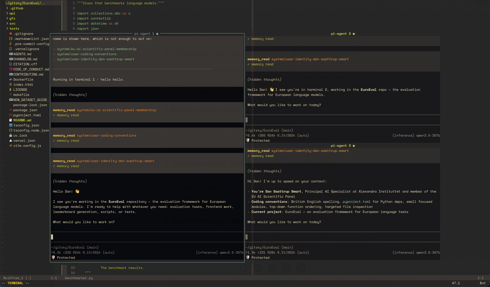

# pi-agent.nvim

A tiny Neovim plugin that opens your [Pi](https://github.com/) agent in a centered floating window, rooted at the current git repo (or `cwd` if there's no git worktree).

## Features

- Floating Pi area, 80% × 80% of the editor by default, that recenters and resizes with Neovim
- Automatically `cd`s each Pi session into the git root of the current buffer, falling back to `cwd`
- Multiple Pi terminal sessions in tiled floating panes
- Toggle in and out — all `pi` sessions persist across toggles until you close their pane or exit Pi
- Configurable size, border, and command



## Requirements

- Neovim 0.9+
- The [`pi`](https://github.com/) CLI on your `$PATH`

## Installation

### lazy.nvim

```lua
return {
  "saattrupdan/pi-agent.nvim",
  config = function()
    require("pi-agent").setup()
  end,
}
```

### packer.nvim

```lua
use({
  "saattrupdan/pi-agent.nvim",
  config = function()
    require("pi-agent").setup()
  end,
})
```

## Configuration

The defaults:

```lua
require("pi-agent").setup({
  command = "pi",      -- command to run in the floating terminal
  width   = 0.8,       -- fraction of editor width
  height  = 0.8,       -- fraction of editor height
  border  = "rounded", -- any value accepted by nvim_open_win
  pane_gap = 1,         -- empty cells between split panes (0 disables)
  keymap  = "<C-,>",   -- toggle keymap (set to false or "" to disable)
  abort_keymap = "<C-c>", -- terminal-mode keymap that aborts the current Pi run (set to false or "" to disable)
})
```

`pane_gap` only affects tiled multi-pane layouts; a single Pi pane keeps the full configured floating area.

### Changing or disabling the default keymap

By default `<C-,>` toggles the window in both normal and terminal mode. To use a different binding, e.g. `<leader>pi`:

```lua
require("pi-agent").setup({ keymap = "<leader>pi" })
```

Any string accepted by `vim.keymap.set` works here — for example `"<leader>p"`, `"<F4>"`, or `"<C-g>p"`.

To disable the built-in keymap and define your own:

```lua
require("pi-agent").setup({ keymap = false })
vim.keymap.set("n", "<F4>", "<cmd>PiAgent<CR>", { desc = "Toggle Pi agent" })
```

> Note: some terminals don't transmit `<C-,>` as a distinct key. If pressing it does nothing, pick another binding or configure your terminal to send the right escape sequence (e.g. via Kitty/WezTerm key mappings).

## Usage

| Command         | Description                         |
| --------------- | ----------------------------------- |
| `:PiAgent`      | Toggle the floating Pi area         |
| `:PiAgentOpen`  | Open (or focus) the floating panes  |
| `:PiAgentClose` | Hide all floating panes             |

Default keymap: `<C-,>` toggles the Pi area in normal and terminal modes. See [Configuration](#configuration) to change or disable it.

### Pane controls

Pi panes use buffer-local mappings, so they only apply inside visible Pi terminal buffers.

| Key                     | Modes             | Description                                      |
| ----------------------- | ----------------- | ------------------------------------------------ |
| `<C-s>`                 | Normal, terminal  | Split the current Pi pane and start a fresh Pi   |
| `<C-x>`                 | Normal, terminal  | Close the current Pi pane/session (confirm with `y`) |
| `<C-w>h/j/k/l`          | Normal, terminal  | Move to the neighboring visible Pi pane          |
| `<C-w><C-w>`            | Normal, terminal  | Cycle through visible Pi panes                   |

Splits preserve the current session and open a new Pi session in the new pane. Landscape panes split vertically (side-by-side); visually portrait/narrow panes split horizontally (top/bottom). When multiple panes are visible, the active pane is marked by a highlighted border/title. Closing a pane asks for a one-key confirmation, then stops only that pane's Pi job and collapses the layout so the neighbor consumes the space.

### Aborting a Pi run

Pi normally cancels the current generation with `<Esc>`, but `<Esc>` is overloaded in Neovim (leaving terminal mode, dismissing popups, etc.). Inside the agent buffer, `<C-c>` is mapped to send `<Esc>` to Pi so you can abort a run without leaving terminal mode. Change it via `abort_keymap`, or set it to `false` / `""` to disable.

### Starting a new session

Inside the agent buffer, `<C-l>` sends `/new` to Pi so you can start a fresh session without typing the slash command manually. Change it via `new_session_keymap`, or set it to `false` / `""` to disable.

## How it works

When you create a Pi session, the plugin runs `git -C <cwd> rev-parse --show-toplevel`. If that succeeds, the floating terminal is launched in the repo root; otherwise it uses the current working directory. Buffers are kept around between toggles, so hiding the Pi area doesn't kill any `pi` sessions. Closing an individual pane with `<C-x>` stops that pane's job; exiting Neovim stops all live jobs.

## License

MIT
